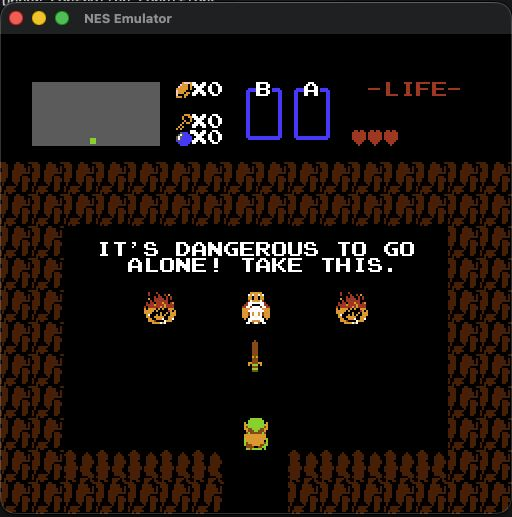

# Laze — LLM-Authored Zero Effort

> ⚠️ **Warning:** This was just an experiment in which I asked Claude Opus 4.7 to create a programming language in the most efficient way it could. It isn't meant to be a serious thing — just a fun weekend project exploring what happens when you let an LLM design its own language.

📝 [LinkedIn Post](https://www.linkedin.com/posts/millerkev_this-weekend-i-asked-ai-to-create-its-own-activity-7459608212556681216-Et-Q?utm_source=share&utm_medium=member_desktop&rcm=ACoAAANNr7sBw8clfttTTZe8qIzMSOLIB6wnxVo)



A programming language optimized for LLM authoring that compiles to native macOS binaries. Indentation-based, minimal punctuation, infix operators.

## Thoughts

Even though this isn't C code, the compiler does generate C internally as an intermediate step. This is an LLM — it specializes in text-based, readable input because that's what it's trained on. It's not going to emit raw bytecode or hand-tuned assembly efficiently. If you wanted a more efficient language, you shouldn't be using an LLM to write it. The point of Laze is to be the language that an LLM can produce the most correct, bug-free code in, as fast as possible. Minimal punctuation, no ambiguity, and direct access to system libraries.

Also... who in their right mind would make a single `nes.laze` file that is 2000+ lines of code... guess the AI will! I didn't ask it to split files, so maybe it needs some additional work.

## Quick Start

```bash
python3 laze/lazec.py hello.laze hello
./hello
```

## Example

```
extern _write
extern _exit

fn main()
  msg := "Hello, world!\n"
  write(1, msg, 14)
  exit(0)
```

## Language Reference

### Functions
```
fn name(param: type, param2: type) -> rettype
  body
```
Types: `u8`, `u16`, `u32`, `u64`, `i8`, `i16`, `i32`, `i64`, `ptr`

### Variables
```
x := 42          ; declare + assign
x = x + 1        ; reassign
```

### Control Flow
```
if condition
  body
end

if condition
  body
else
  body
end

while condition
  body
end
```

### Operators
All standard infix: `+ - * / % & | ^ << >> == != < > <= >= && ||`

### Memory (byte arrays)
```
buf := malloc(1024)
buf[0] = 65          ; store byte
v := buf[0]          ; load byte
```

### Directives
```
extern _funcname     ; declare external C function
link SDL2            ; link library
linkpath /opt/lib    ; add library search path
framework Cocoa      ; link macOS framework
```

### Comments
```
; this is a comment
```

## Architecture

The compiler (`laze/lazec.py`) is a Python tool that:
1. Parses `.laze` source into an AST
2. Generates C internally (never written to disk)
3. Pipes to `cc -O2` for optimized native binary output

No `.c` files are created — code exists only in memory during compilation.

## NES Emulator

A complete NES emulator written in Laze:

```bash
python3 laze/lazec.py nes.laze nes
./nes "Super Mario Bros. (World).nes"
./nes "Legend of Zelda, The (USA) (Rev 1).nes"
```

Requires SDL2 (`brew install sdl2`). Defaults to "Super Mario Bros. (World).nes" if no argument given.

### Features
- 6502 CPU (all official opcodes)
- PPU with background, sprites (8x8 and 8x16), scrolling
- APU with 2 square wave channels + triangle
- Controller input
- Mapper 0 (NROM), Mapper 1 (MMC1), Mapper 4 (MMC3)

### Controls
- Arrow keys: D-pad
- Z: A button
- X: B button
- Return: Start
- Right Shift: Select

### Supported Games
- Super Mario Bros. (Mapper 0) — fully playable
- Legend of Zelda (Mapper 1) — playable with minor glitches
- Super Mario Bros. 3 (Mapper 4) — experimental
